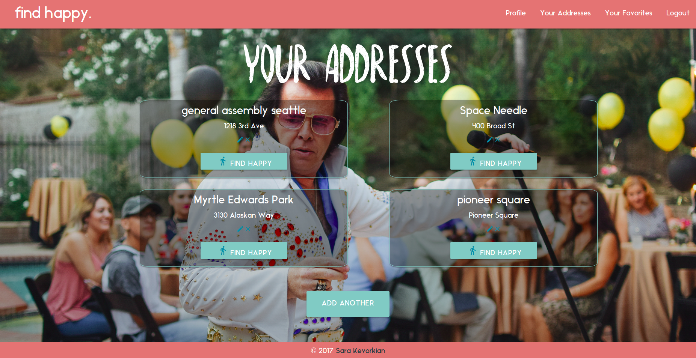
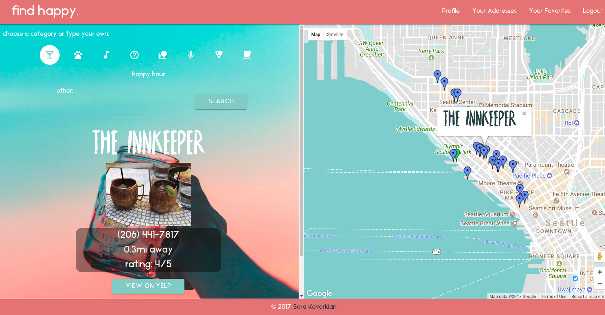
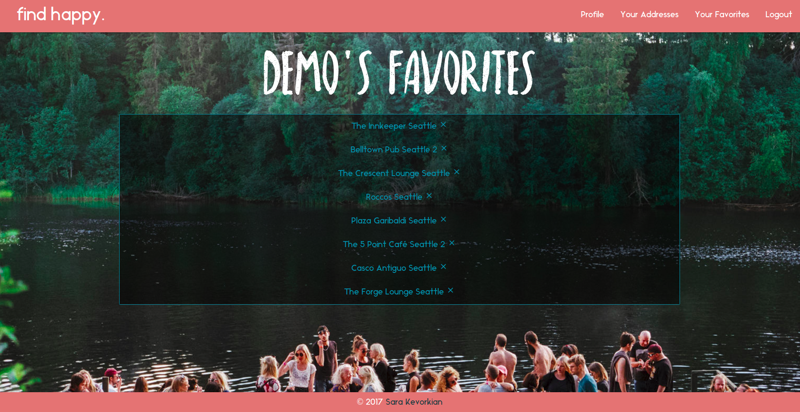
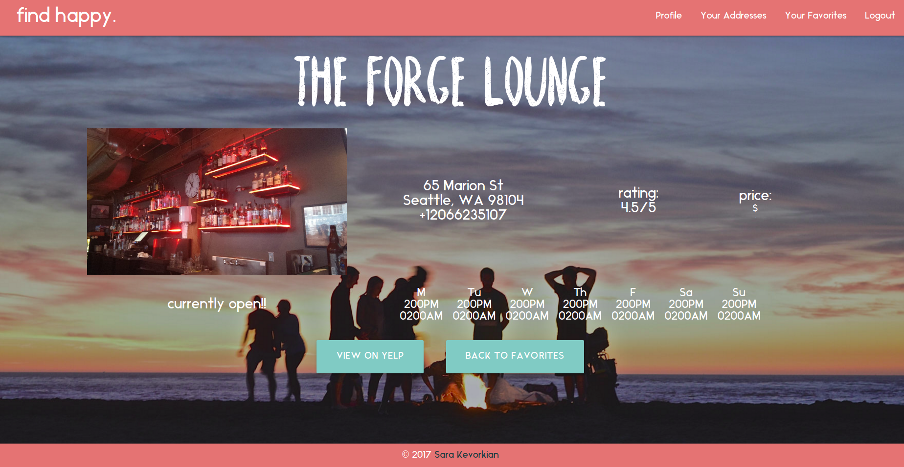

 <h1>This is a site where you can save addresses and search for fun places nearby! Very useful for traveling to unfamiliar locations.</h1>

 <h2>technologies used</h2>
HTML, CSS, Javascript, Node.js, Express.js, Materialize CSS, Google Maps API, Yelp API, Google Geocoder API

 <h2>approach taken</h2>

 My main approach was to finish the functionality first.
 Before coding anything I read documentation for the yelp node wrapper and tested the APIs.
 I mapped out the routes and used limited page layout to test that routes were working.
 I began with only allowing hte user to add and search their addresses. Then I added the saving favorite yelp businesses functionality.
 Finally I added styling and continued troubleshoot/add new features slowly.

 1) I started by drawing out my ideas on paper
 2) then I planned out my tables (starting with users and addresses)
 3) tested various searches with yelp api to make sure my goal was feasible
 4) set up login functionality and tested that
 5) set up each route for the addresses page
 6) made main map page where search occurs
 7) introduced favorite functionality, began by planning my table (M:M) and plotting routes
 8) styled each page, and in the process made sure my links between pages and other functionality was as I expected

<h2>installation instructions</h2>

To install a local copy of my site you can fork and/or clone the repository.
Run npm install to grab all the dependencies outlined in the package.json file.
Create a database for the project and run sequelize init. follow the prompts and set up your config file.
Run sequlize db:migrate to create the tables/associations/methods involved with the database.
You will need to set a Yelp API Key(ACCESS_KEY), Google Maps Key(GOOGLEMAPS\_KEY), and Sessions Secret(SESSION\_SECRET) in your .env file.
Run nodemon in the terminal and go to the localhost:3001 in your browser

 <h2>user stories</h2>

 1) I am going on vacation and want to find fun stuff near by but don't know the location very well. Plus typing the address into yelp or other search places multiple times is annoying.
 2) My friend and I live far away from each other and want to meet up halfway but don't know what is around.

<h2>Screenshots</h2>

